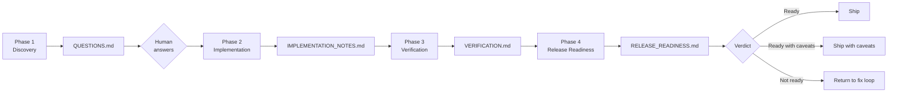

# review-to-release-workflow

[](https://skills.sh/)
[](#workflow)
[](#human-in-the-loop-checkpoints)

A structured four-phase engineering workflow skill for coding agents. Runs
discovery, implementation, verification, and release readiness in sequence, with
explicit Human in the Loop approval gates at each critical decision point.

## Install

```bash
npx skills@latest add glaucia86/skills --skill review-to-release-workflow
```

Or clone and install locally:

```bash
npx skills add ./ --skill review-to-release-workflow
```

## When to use

Use this skill when you want the agent to:

- review the codebase before making broad changes
- surface ambiguities, risks, and missing decisions upfront
- generate a structured `QUESTIONS.md` and wait for human answers
- implement only changes that were explicitly approved
- verify that every approved change was applied correctly
- assess whether the result is genuinely ready for merge, staging, or production

Do not use this skill for quick isolated fixes that need no structured
discovery, approval flow, or release gate.

## Workflow



## Phases

### Phase 1 — Discovery

**File:** `01-codebase-review-question-audit.md`

The agent performs a deep, structured review of the codebase from the
perspective of a staff/principal engineer. It identifies ambiguities,
architectural risks, missing decisions, and suspicious patterns — then
consolidates findings into a `QUESTIONS.md` file.

**Output:** `QUESTIONS.md`

**Stop condition:** The agent will not proceed to Phase 2 without human
answers to all relevant questions.

---

### Phase 2 — Implementation

**File:** `02-questions-md-resolution-implementation.md`

The agent reads the answered `QUESTIONS.md`, classifies each decision with
a tag (`[APPROVED]`, `[DEFERRED]`, `[OUT-OF-SCOPE]`, `[BLOCKED]`), builds a
scoped implementation plan, presents it for human approval, and only then
applies the changes.

**Output:** approved code changes + `IMPLEMENTATION_NOTES.md`

**Stop condition:** The agent will not write code before the human explicitly
approves the scoped plan. Unanswered or contradictory answers block this phase.

---

### Phase 3 — Verification

**File:** `03-implementation-verification-pass.md`

The agent independently verifies every change against the approved decisions.
Items are graded by severity:

| Severity | Meaning |
|---|---|
| **Must Fix** | Blocks release |
| **Should Fix** | Important but not blocking |
| **Acceptable** | Minor, can be deferred |

**Output:** `VERIFICATION.md`

**Stop condition:** Any unresolved Must Fix item blocks Phase 4.

---

### Phase 4 — Release Readiness

**File:** `04-release-readiness-pass.md`

The agent reviews code correctness, operational readiness, documentation,
configuration, and deployment risk relative to the confirmed release target.
Issues are graded with the same severity scale.

**Output:** `RELEASE_READINESS.md`

**Verdict values:**

| Verdict | Meaning |
|---|---|
| `Ready` | Safe to ship as-is |
| `Ready with caveats` | Safe to ship with documented conditions |
| `Not ready` | Must fix blocking issues before shipping |

---

## Human in the Loop Checkpoints

| After | Checkpoint |
|---|---|
| Phase 1 | Human answers all questions in `QUESTIONS.md` |
| Phase 2 (before coding) | Human approves the scoped implementation plan |
| Phase 4 | Human reads the verdict and decides whether to ship |

## Output Artifacts

| File | Produced in |
|---|---|
| `QUESTIONS.md` | Phase 1 |
| `IMPLEMENTATION_NOTES.md` | Phase 2 |
| `VERIFICATION.md` | Phase 3 |
| `RELEASE_READINESS.md` | Phase 4 |

## Pre-workflow: confirm release target

Before Phase 1 begins, the agent confirms the intended release target:

- `local demo`
- `internal prototype`
- `team handoff`
- `staging`
- `production`
- `open-source release`

The target determines the level of rigor applied across all four phases.
If not provided, the agent infers a provisional target and marks it as a
caveat in the output.

## File Structure

```text
review-to-release-workflow/
  SKILL.md
  README.md
  01-codebase-review-question-audit.md
  02-questions-md-resolution-implementation.md
  03-implementation-verification-pass.md
  04-release-readiness-pass.md
  evals/
    evals.json
```

## Evals

This skill includes 8 discriminative eval prompts in `evals/evals.json`
covering positive and negative scenarios for each phase gate.

---

[← Back to skills catalog](../README.md)
